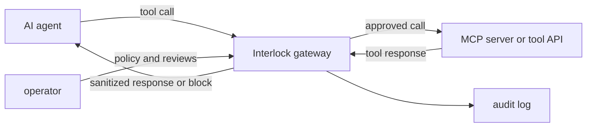

# Interlock Threat Model

Interlock is an MCP runtime trust layer for AI agents. It sits between agents and MCP servers or tool APIs and makes an allow, deny, monitor, or quarantine decision before or after tool execution depending on the control.

---

## Assets Protected

- MCP tool definitions and approval baselines
- tool-call arguments sent by agents
- tool responses before they are returned to the model or agent loop
- API keys and per-key policy configuration
- audit evidence for security review
- provenance metadata for MCP servers and packages

---

## Trust Boundaries

The main boundary is the gateway. Agents and MCP servers are not assumed to be fully trusted.

---

## In Scope Threats

| Threat | Control |
|---|---|
| MCP tool poisoning | tool-definition validation, metadata normalization, baseline comparison |
| Post-approval drift | schema/capability/provenance drift detection and quarantine |
| Privilege escalation | role-aware RBAC before tool execution |
| Dangerous tool arguments | SQL, shell, file, code, SSRF, and path traversal inspection |
| Response prompt injection | response injection scanner before content returns to the agent/model |
| Secrets and PII in responses | redaction and output data-leak detection |
| Missing audit trail | durable MCP audit log and scan history |
| Shadow MCP servers | operator-provided target probing and review state |
| Supply-chain drift | source registry, package, version, URL, and hash policy |

---

## Out Of Scope Or Not Guaranteed

- Interlock does not guarantee that every malicious prompt or tool response is detected.
- Interlock does not replace secure MCP server implementation.
- Interlock does not replace identity provider, SSO, endpoint protection, or network security controls.
- Shadow discovery only probes operator-configured targets. It does not discover every server in an enterprise network automatically.
- The default SQLite deployment is for local use and pilots, not multi-replica high availability.
- LLM judge behavior depends on configured upstream provider availability and fail-mode policy.

---

## Failure Modes

Interlock supports key-level fail modes for the prompt scan path:

| Mode | Behavior |
|---|---|
| `fail_closed` | block when the judge layer is unavailable |
| `fail_open` | allow when the judge layer is unavailable |
| `fail_open_safe` | continue with deterministic layers and avoid hard failure where possible |

MCP gateway controls should prefer deterministic policy, metadata, drift, provenance, argument inspection, and response scanning wherever possible.

---

## Data Handling

Default local deployment stores configuration and audit data in SQLite under `data/firewall.db` or `FIREWALL_DB_PATH`.

Recommended pilot handling:

- avoid logging raw customer secrets
- use fake PII in demos
- document retention period for audit logs
- back up SQLite before meaningful pilots
- use a dedicated API key per buyer or environment

---

## Security Review Questions

A buyer should ask:

- Which traffic path is in scope: `/scan`, `/inspect/tool-call`, `/mcp/call`, or all of them?
- Which MCP servers are trusted, monitored, or blocked?
- Which agent roles are allowed to call which tool classes?
- What happens when drift is detected?
- What evidence lands in the audit log?
- What fail mode is configured per key?
- What data is stored locally and for how long?
